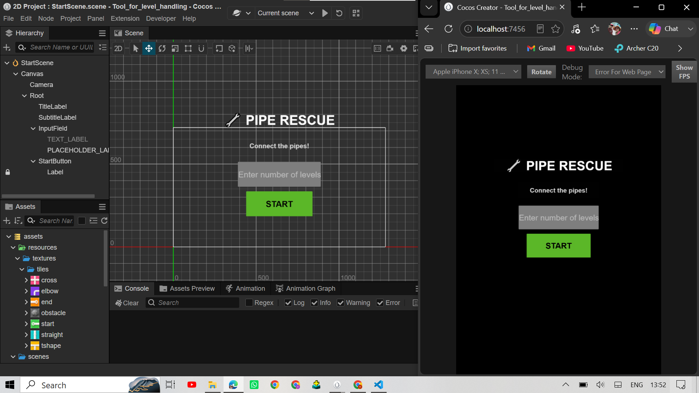
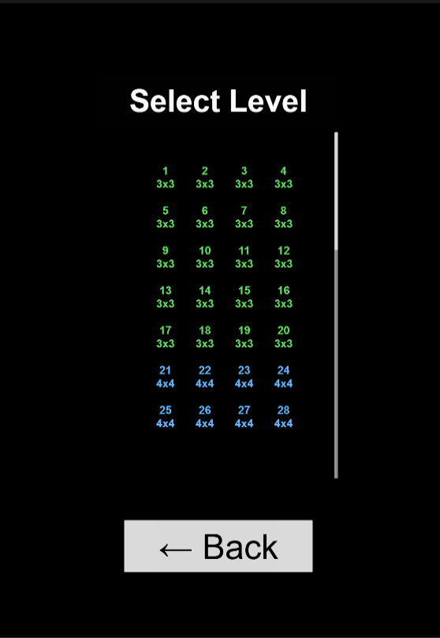
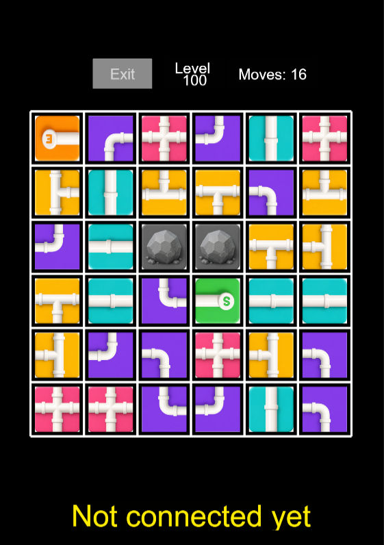
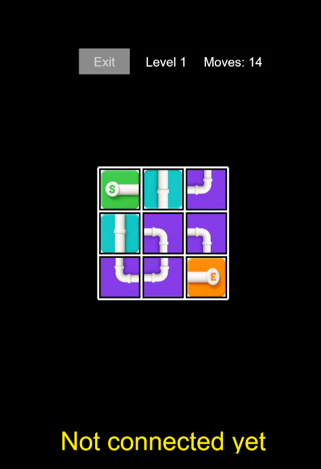
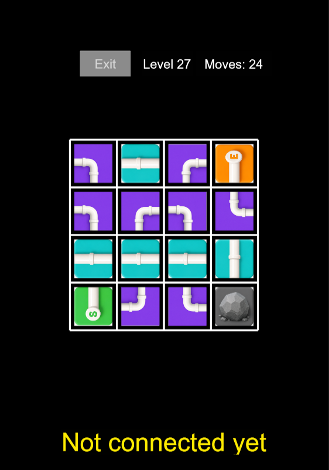
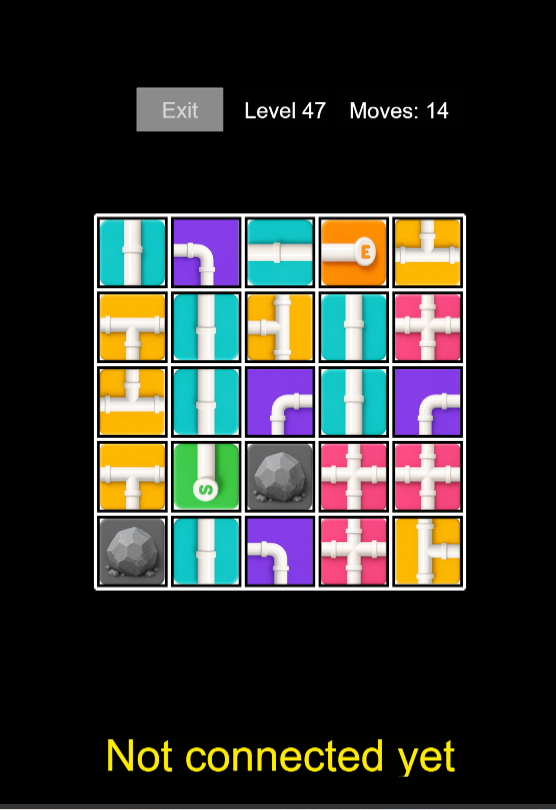
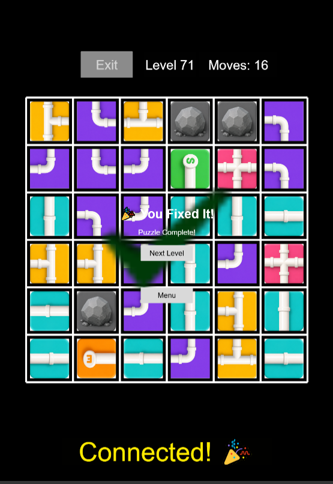

# 🔧 Pipe Rescue

A procedurally generated pipe-connection puzzle game built with **Cocos Creator** and **TypeScript**. Rotate tiles to connect a path from **START** to **END** before you run out of moves — across dynamically generated levels of increasing difficulty.

---

## 📸 Screenshots

### Scenes

| Start Scene | Level Select Scene | Game Scene |
|:---:|:---:|:---:|
|  |  |  |

### Grid Types

| 3x3 | 4x4 |
|:---:|:---:|
|  |  |

| 5x5 | 6x6 |
|:---:|:---:|
|  |  |

---

## ✨ Features

- **Dynamic level generation** — enter any number of levels (1–500+) and the game procedurally builds a fresh, solvable puzzle set every time
- **4 grid sizes** — 3×3, 4×4, 5×5, 6×6, distributed proportionally (20/20/20/40%) as difficulty scales
- **Guaranteed solvable** — every level is built path-first, then verified with a BFS path checker before being shown to the player
- **Special tiles** — STRAIGHT, ELBOW, T-SHAPE, CROSS (4-way), and OBSTACLE (blocked stone tiles) introduced progressively by grid size
- **Fair move limits** — minimum rotations required is calculated per level, with a difficulty-based buffer added on top
- **Sprite-based rendering** — real pipe artwork with smooth rotation, dynamic grid lines, and auto-scaling containers per grid size

---

## 🛠️ Tech Stack

- **Engine:** Cocos Creator 3.8.6
- **Language:** TypeScript
- **Rendering:** Sprite-based with Cocos `Graphics` for grid lines

---

## 🚀 Setup & How To Run

1. Install [Cocos Creator 3.8.6](https://www.cocos.com/creator) (or later 3.x)
2. Clone this repository
3. Open Cocos Creator → **Open Project** → select the cloned folder
4. Wait for asset import to finish
5. Go to **Project → Project Settings → Project Data → Editor Default Scene** → set to `StartScene`
6. Open `StartScene` in the editor
7. Press **Play ▶️**
8. Enter the number of levels you want and hit **Start**

---

## 🏗️ Project Architecture

```
Game Flow:
StartScene → LevelSelectScene → GameScene
   (enter N)      (pick level)      (play)
```

```
assets/
├── resources/
│   └── textures/tiles/      → pipe sprite images (start, end,
│                                straight, elbow, tshape, cross, obstacle)
├── scenes/
│   ├── StartScene.scene
│   ├── LevelSelectScene.scene
│   └── GameScene.scene
└── scripts/
    ├── TileData.ts          → tile types, rotation math, config
    ├── PathChecker.ts       → BFS connectivity check (checkPath, getPath)
    ├── LevelGenerator.ts    → procedural level generation (the core brain)
    ├── LevelLoader.ts       → singleton, holds generated levels in memory
    ├── SceneManager.ts      → singleton, handles scene navigation
    ├── GridRenderer.ts      → draws grid lines + tile sprites dynamically
    ├── StartScene.ts        → input screen logic
    ├── LevelSelectScene.ts  → level picker logic
    └── GameScene.ts         → core gameplay loop
```

### How Level Generation Works

1. **Random walk** — generate a path from a start cell to an end cell (corner-biased or random, never revisiting a cell)
2. **Tile assignment** — walk the path and assign STRAIGHT/ELBOW tiles with the *correct* rotation needed to connect it
3. **Verify solution** — run the BFS path checker to confirm START connects to END
4. **Fill remaining cells** — every non-path cell is filled with a random pipe tile (or an OBSTACLE/CROSS tile on larger grids) so no cell is left empty
5. **Scramble** — randomize rotations on all rotatable tiles (guaranteed different from the solved rotation)
6. **Re-verify** — confirm the scrambled grid is *not* already solved
7. **Move count** — count exact rotations needed to re-solve it, then add a difficulty buffer (20–40% depending on grid size) to get `maxMoves`

---

## 🧩 Challenges & Solutions

| Challenge | Solution |
|---|---|
| Tiles overlapping outside their grid cell on larger boards | Introduced a `padding` ratio per grid size so tile sprite size shrinks relative to its cell as grid size increases |
| Level generation silently failing on 5×5/6×6 (low success rate) | Increased `maxAttempts` per grid size and added a direction-biased DFS so the random walk reaches the target corner more reliably |
| Straight-line path segments misclassified as ELBOW tiles | Fixed `getTileTypeForCell()` — it was missing the case where `fromDir === toDir` (a straight continuation), causing broken/unsolvable solution grids |
| `onDestroy()` crashing with "Cannot read properties of null" on scene switch | Added null-safety checks before removing event listeners in every scene script |
| ScrollView not scrolling / content cut off for large level counts | Dynamically resize the `content` node's height based on level count instead of using a fixed size |
| Start/End always spawning in corners (repetitive levels) | Mixed 70% random-position placement with 30% corner placement for more varied puzzles |

---

## 📋 Tile Types

| Tile | Behavior |
|---|---|
| START / END | Fixed anchor points, not rotatable |
| STRAIGHT | Connects two opposite sides |
| ELBOW | Connects two adjacent sides (a turn) |
| T-SHAPE | Connects three sides (5×5, 6×6 only) |
| CROSS | Connects all four sides, not rotatable (5×5, 6×6 only) |
| OBSTACLE | Blocks the path entirely, not rotatable (4×4+) |

---

## 🔮 Future Improvements

- Multiple valid solution paths per level for replayability
- Path-aware placement of T-SHAPE/CROSS tiles *within* the solution path itself
- Save/load progress between sessions
- Level difficulty rating shown on the select screen

---

## 👤 Author

Built as a personal project to practice procedural generation, pathfinding, and Cocos Creator game architecture.
